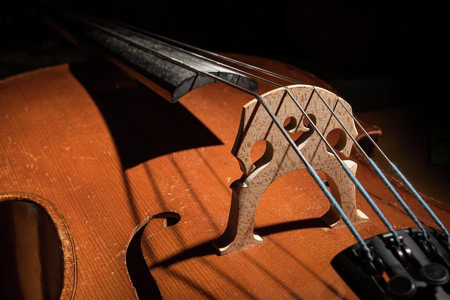
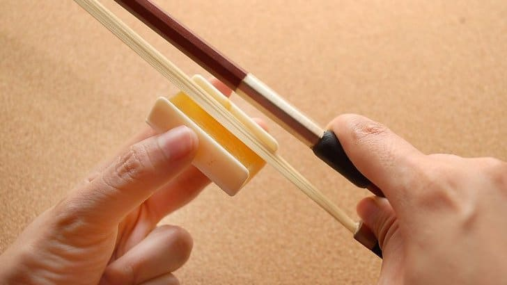
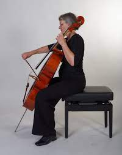
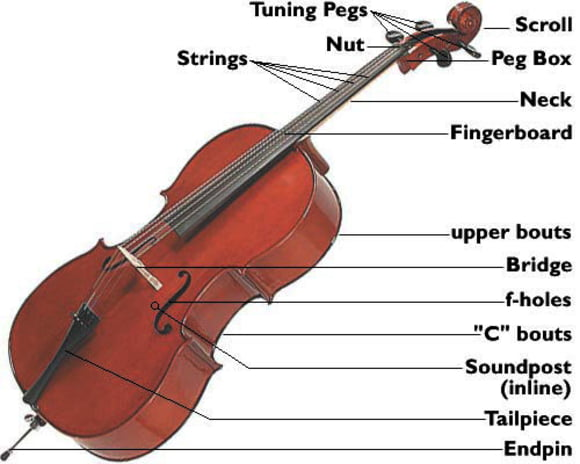
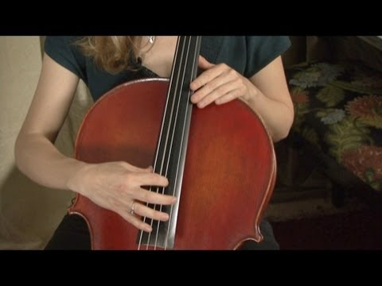

# How to Play the Cello

The cello, or violoncello, is a large wooden 4-stringed instrument in the violin family. It can be played with a bow, or plucked using fingers. The cello can be played solo or in a group. Below are instructions on how to play the cello by plucking and bowing. It requires a lot of time and practice to do it well, but once the basics are mastered, it is a very fun and rewarding hobby.
**Note: Prior experience with other instruments is useful, but not necessary.**

## What do you need?
- Cello
- Bow
- Cello Rosin
- Chair
- Fingers

## Warning!
- Do not touch the bow hairs directly, skin oils will harm the hairs
- Keep rosin out of reach of small children

## Steps

### 1. Prepare the bow

- Take the bow out of the case without touching the hairs
- Locate the screw at the base of the bow and turn it clockwise until the hairs have tension, but be careful not to make them too tight that the bow begins to bend outward.
- Rub the rosin along the outward facing side of the bow hairs. Do this until the bow hairs are lightly coated in rosin, but do not overdo it.

### 2. Position the Cello

- Carefully remove the cello from its case
- Loosen the screw at the bottom to release the endpin
- Extend the endpin and tighten it at a point at which when in a sitting position, the cello comfortably rests against the chest.
- Now you are ready to play!

### 3. Pluck the Cello (Pizzicato)

- Use the index or middle finger on the right hand to gently touch one string at a spot near the bottom of the fingerboard (see image).
- Bring your finger upwards, away from the cello, while lightly grabbing a string with one finger and let it release.
- Let the string vibrate. You just played a note!
- To play different notes, bring the left hand up to the neck of the cello and press down on the string with one finger while plucking with the other hand.

### 4. Bow the Cello (Arco)

- Using the right hand, hold the bow at its base, which is called the "frog".
- Gently touch the hairs of the bow to one string on the cello.
- Slowly move the bow to the side while maintaining friction with the string.
- If the cello is producing a steady sound, then you are doing it right!
- As before, use the left hand to play different notes while moving the bow at the same time.

### 5. Practice!!!

- Repeat steps 3 and 4 numerous times until you get the hang of it. Nobody ever gets it right the first time, so do not get frustrated if you are not good at it right away.
- Once you master the basics, there are many more advanced techniques to try.
- Never stop practicing.
